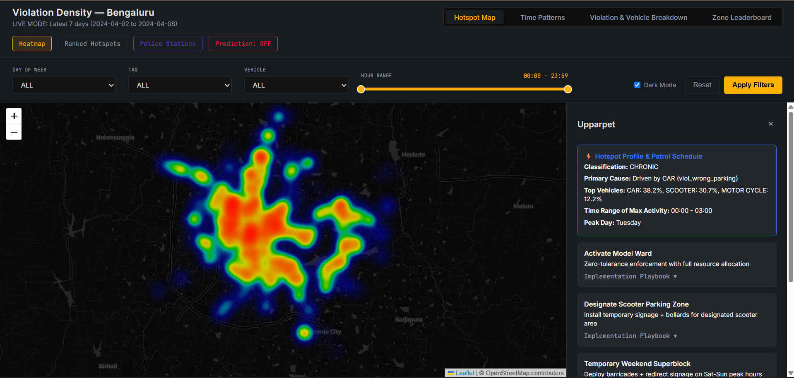
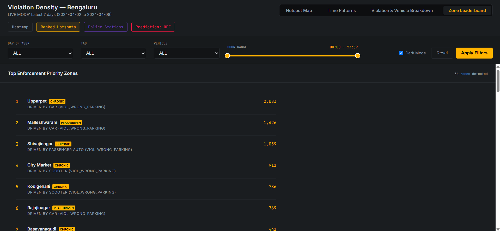
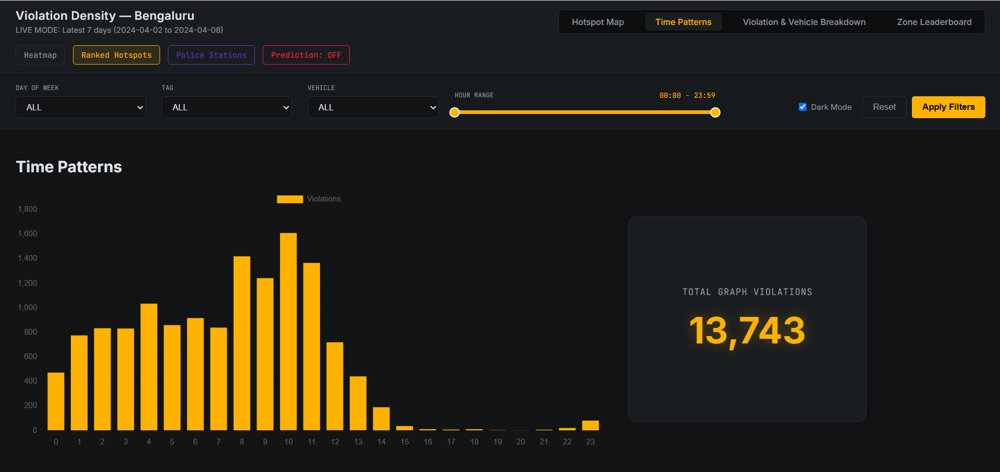
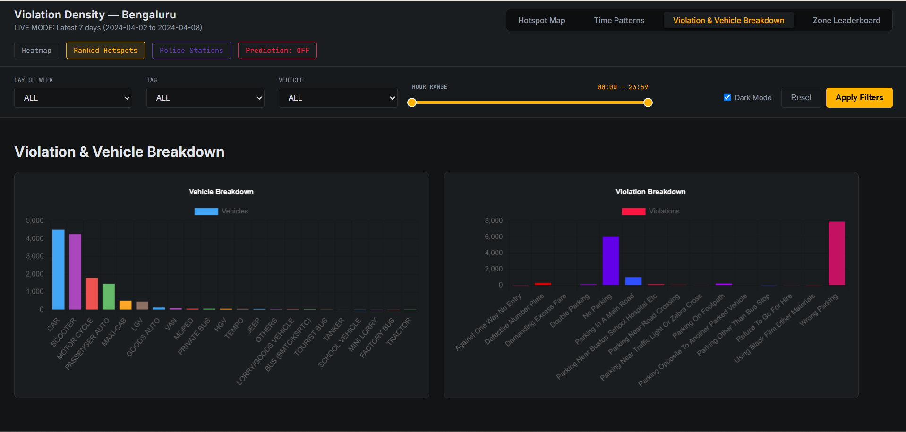

# 🚦 Parking Enforcement Intelligence

**A Predictive Hotspot Detection & Enforcement Prioritisation System for Bengaluru**

Built for **Gridlock Hackathon 2.0, Round 2** — Theme: *Parking-Induced Congestion*
Team: **Solaris**

**Live Demo:** [https://solaris-pei.up.railway.app/](https://solaris-pei.up.railway.app/)

---

## What this is

Bengaluru's traffic police currently rely on patrol-based, reactive enforcement with no systematic way to see where illegal parking is choking traffic the most, or to anticipate where it will happen next. This project turns historical parking-violation records into an interactive intelligence system that:

- **Detects historic hotspots** using spatial clustering, ranked by a **PCU-weighted impact score** (a parked bus blocking 3.5× the road of a car, rather than counting as one violation) derived from the Indian Highway Capacity Manual.
- **Classifies each hotspot** by temporal duration and burstiness profile — *Short Fixed-Window / Long Spread-out*, *Single Sharp Peak / Multiple Sporadic Peaks* — so classification maps directly onto a patrol-deployment decision.
- **Predicts tomorrow's hotspots** with a calendar-similarity k-Nearest-Neighbours model, using day-of-week, festival, Karnataka-specific holiday, and second-Saturday features with a recency bonus.
- **Profiles each hotspot** by dominant vehicle type, nearest landmark, and peak activity hour.
- **Recommends enforcement strategies** via a rule-based decision engine drawing on 9 internationally-precedented parking-management approaches (Vietnam Model Ward, Taipei 5-Pillar Scooter Zoning, Bangkok Win System, Barcelona Superblocks, and more), plus a linear-programming-based resource allocator that distributes limited enforcement officers to maximize total PCU congestion relief.
- **Generates implementation playbooks** — context-aware, zone-specific action plans that account for archetype (CBD, IT Corridor, Transit Hub), personnel quality, spatial spillover pressure, and infrastructure permanence.

The result is a single command-center dashboard: a live heatmap and ranked zone leaderboard, filterable by day/hour/vehicle/violation type, a "Predict Tomorrow" toggle for the next-day forecast, time-pattern and vehicle-breakdown views, and a per-zone detail panel with concrete enforcement playbooks.

This is a working prototype built within a hackathon timeline, not a finished production system — some components (workforce scheduling, patrol routing, live feedback loops) are intentionally simplified for now.

---

## Screenshots

| Hotspot Heatmap | Zone Leaderboard |
|---|---|
|  |  |

| Time Patterns | Vehicle & Violation Breakdown |
|---|---|
|  |  |

---

## System Architecture

```
┌─────────────────────────────────────────────────────────────────────────┐
│                         Raw Violation CSV                              │
│                 (Jan–May, ~298K anonymized records)                    │
└──────────────────────────────┬──────────────────────────────────────────┘
                               │
                    ┌──────────▼──────────┐
                    │   Data Loader       │  Parse violation JSON, drop PII,
                    │   + Cleaner         │  handle nulls, UTC→IST conversion
                    └──────────┬──────────┘
                               │
                    ┌──────────▼──────────┐
                    │ Feature Engineer    │  PCU weights, cyclical time encoding,
                    │                     │  zone-hourly aggregation, archetypes,
                    │                     │  persistence scores, weekend surge,
                    │                     │  spatial lag / balloon effect
                    └──────────┬──────────┘
                               │
              ┌────────────────┼────────────────┐
              │                │                │
   ┌──────────▼─────┐   ┌──────▼───────┐ ┌──────▼──────────┐
   │  ML Ensemble   │   │ Calendar KNN │ │ Time Clustering │
   │  (LightGBM +   │   │ Predictive   │ │  (Duration +    │
   │   CatBoost +   │   │ Engine       │ │   Burstiness)   │
   │   XGBoost)     │   │              │ │                 │
   └──────────┬─────┘   └──────┬───────┘ └──────┬──────────┘
              │                │                │
              └────────────────┼────────────────┘
                               │
                    ┌──────────▼──────────┐
                    │  Decision Engine    │  9 global strategies, rule-based
                    │  + LP Allocator     │  selection, implementation playbooks,
                    │                     │  constrained officer allocation
                    └──────────┬──────────┘
                               │
                    ┌──────────▼──────────┐
                    │  FastAPI Server     │  REST API + scheduled pipeline,
                    │  + Dashboard        │  Leaflet heatmap, Chart.js analytics,
                    │                     │  dark control-room UI
                    └─────────────────────┘
```

### Layer 1 — Spatial Hotspot Detection & Classification

- **PCU-Weighted Impact Score**: Instead of treating all violations equally, each vehicle is weighted by the physical road space it blocks using Indian Highway Capacity Manual values (Scooter = 0.5, Car = 1.0, Bus = 3.5, HGV = 4.5). A single illegally parked bus contributes 7× the impact of a scooter.
- **Zone-Hourly Aggregation**: Violations are grouped by police station × day-of-week × hour, producing the target variable `total_pcu_impact`.
- **Temporal Classification**: Each zone is classified along two axes — *Duration* (Short/Long active window) and *Burstiness* (Single peak vs. sporadic) — using thresholded peak analysis on hourly violation profiles.

### Layer 2 — Predictive Engine (Calendar-Similarity KNN)

- **Design Rationale**: Traffic violations are highly cyclical and context-dependent. A Sunday-before-a-festival behaves differently from a regular Tuesday.
- **Mechanics**: A custom weighted-Euclidean KNN model searches historical data for the *K* days with the most similar calendar signature to tomorrow (is_festival, is_holiday, is_monday, is_tues_to_fri, is_sat_sun, is_second_saturday), with a recency bonus favoring recent data.
- **Confidence Scoring**: Weighted neighbor agreement — the fraction of similar historical days where a zone was a hotspot, weighted by calendar distance. The confidence threshold is frozen from validation.
- **Model Selection**: Offline grid search over K values (8, 12, 16, 20) and 3 feature-weight derivation methods (Random Forest importance, correlation, equal) on the validation set, evaluated once on a held-out test set.
- **Validation**: Walk-forward (rolling-origin) validation — at any point, the model only sees data from before the day it's predicting, matching real-world deployment. Metrics: precision, recall, F1.

### Layer 3 — ML Ensemble (PCU Impact Regression)

- **Models**: LightGBM + CatBoost + XGBoost, trained on 20 engineered features including cyclical time encoding, vehicle composition ratios, spatial spillover (balloon effect), zone archetype, and enforcement quality signals.
- **Walk-Forward Cross-Validation**: Expanding-window time splits (Nov → Dec → Jan → ... → Apr) to respect temporal ordering.
- **Ensemble Optimization**: Nelder-Mead simplex optimization finds mathematically optimal blend weights across the three models, evaluated per fold and overall via out-of-fold predictions.

### Layer 4 — Decision Engine & Resource Allocation

- **Strategy Selection**: A rule-based mapper cross-references each zone's profile (vehicle composition, archetype, persistence score, weekend surge ratio, PCU impact) against 9 globally-proven enforcement strategies.
- **Implementation Playbooks**: Context-aware, zone-specific action plans generated from the zone's profile data — covering location, scale, timing, personnel, materials, and inter-zone coordination.
- **Constrained Resource Allocation**: A Linear Programming solver (SciPy HiGHS) distributes limited enforcement officers across predicted hotspots to maximize total `PCU_impact × strategy_effectiveness`, subject to minimum officer requirements per strategy and a global budget constraint.

---

## Enforcement Strategies Catalog

| Strategy | Source | Trigger |
|:---|:---|:---|
| Activate Model Ward | Vietnam (Hanoi) | Historical violations > 15,000 |
| Designate Scooter Zone | Taiwan (Taipei) | Two-wheeler ratio > 50% |
| Create Auto-Rickshaw Stand | Thailand (Bangkok Win) | Three-wheeler ratio > 25% |
| Temporary Superblock | Spain (Barcelona) | Weekend + surge ratio > 1.2 |
| Park-and-Ride | Indonesia (Jakarta) | Zone archetype is IT_CORRIDOR / SUBURBAN_TECH |
| Time-Window Loading | Indonesia/UK (Jakarta + London) | Heavy vehicle ratio > 10% |
| Deploy Tow Truck (PCU Priority) | USA/Japan (SFpark + Tokyo) | PCU impact > 50 |
| Formalize as Designated Zone | Rwanda (Kigali) | Persistence score > 0.8 |
| Geofenced No-Idle Zone | Bangalore-specific | IT corridor + auto ratio > 15% |

---

## Evaluation Approach

The predictive KNN model is validated with a chronological train / validation / test split and **walk-forward (rolling-origin) validation** — at any point, the model only sees data from strictly before the day it's predicting, matching how it behaves in production. The confidence threshold and neighbor count (K) are chosen empirically by sweeping precision, recall, and F1 on the validation set, then frozen and applied once to a held-out test set. We report precision, recall, and F1 rather than plain accuracy, since accuracy is misleading on an imbalanced hotspot/non-hotspot split.

The ML ensemble uses **walk-forward TimeSeriesSplit** cross-validation with expanding windows to respect temporal ordering. Ensemble weights are optimized via Nelder-Mead on out-of-fold R² scores.

---

## Tech Stack

| Layer | Technology |
|:---|:---|
| Data Processing | Python, pandas, NumPy |
| Spatial Features | Haversine distance, zone centroid adjacency maps |
| ML Ensemble | LightGBM, CatBoost, XGBoost (Nelder-Mead weight optimization) |
| Predictive Engine | Custom calendar-similarity k-Nearest-Neighbours |
| Feature Weight Derivation | scikit-learn (Random Forest, Linear Regression, Mutual Information) |
| Resource Allocation | SciPy Linear Programming (HiGHS solver) |
| Model Evaluation | Walk-forward validation, threshold sweep, per-day metric spread |
| Backend / API | FastAPI, Uvicorn, APScheduler (daily pipeline cron) |
| Frontend Mapping | Leaflet.js + leaflet.heat |
| Frontend Charting | Chart.js |
| Frontend Styling | Custom CSS, dark control-room theme, noUiSlider |
| Containerization | Docker, Docker Compose |

---

## Getting Started

### Option A — Local Setup

```bash
# Clone and enter the repo
git clone <repo-url>
cd <repo-name>

# Create and activate virtual environment
python -m venv venv
source venv/bin/activate        # On Windows: venv\Scripts\activate

# Install dependencies
pip install -r requirements.txt
```

**1. Prepare the data and train models (first time only):**

```bash
python run.py --all
```

This runs the complete end-to-end pipeline: data loading → feature engineering → ML model training → map data generation. Intermediate results are saved so subsequent runs can skip stages.

**2. Start the server:**

```bash
uvicorn src.server.fastapi_server:app --host 0.0.0.0 --port 8000
```

Then open `http://localhost:8000` in your browser.

### Option B — Docker

```bash
docker compose up --build
```

The server will be available at `http://localhost:8000`.

### CLI Reference

```bash
python run.py --all           # Run everything (data → features → train → map)
python run.py --prepare       # Only run data loading and feature engineering
python run.py --train         # Only run ML model training
python run.py --decision      # Run decision engine (add --day and --hour)
python run.py --map           # Generate map data (add --day and --hour)

# Optional parameters
python run.py --decision --day 0 --hour 9    # Monday 9 AM
python run.py --map --day 6 --hour 10        # Sunday 10 AM (default)
```

---

## Project Structure

```
.
├── run.py                                  # Unified CLI entry point
├── config.py                               # PCU weights, thresholds, zone archetypes
├── requirements.txt                        # Python dependencies
├── Dockerfile                              # Container definition
├── docker-compose.yml                      # Docker Compose orchestration
│
├── src/
│   ├── data_processing/
│   │   ├── data_loader.py                  # CSV loading, cleaning, UTC→IST conversion
│   │   ├── feature_engineer.py             # PCU weights, temporal/spatial features, aggregation
│   │   ├── generate_map_data.py            # Heatmap points & zone markers for Leaflet
│   │   ├── time_clustering.py              # Duration & burstiness classification
│   │   ├── karnataka_calendar.py           # Karnataka holidays & festivals reference
│   │   └── calc_weights.py                 # PCU weight calculations
│   │
│   ├── modeling/
│   │   ├── knn_core.py                     # Calendar-similarity KNN primitives
│   │   ├── predictive_engine.py            # Next-day hotspot prediction pipeline
│   │   ├── model_trainer.py                # LightGBM + CatBoost + XGBoost ensemble
│   │   ├── model_tuning.py                 # Offline KNN model selection & tuning
│   │   ├── evaluate_model.py               # Walk-forward evaluation & threshold sweep
│   │   ├── decision_engine.py              # Strategy selection, playbooks, LP allocation
│   │   └── hotspot_classifier.py           # Hotspot classification by temporal profile
│   │
│   ├── pipelines/
│   │   └── pipeline.py                     # Full end-to-end pipeline orchestrator
│   │
│   ├── server/
│   │   └── fastapi_server.py               # FastAPI backend, REST API, scheduled pipeline
│   │
│   ├── utils/
│   │   └── compare_weights.py              # Calendar feature weight comparison utility
│   │
│   └── visualizations/
│       ├── plot_average_day.py             # Average daily violation pattern plots
│       ├── plot_single_day.py              # Single-day violation profile plots
│       └── plot_threshold.py               # Threshold vs. evaluation metrics plot
│
├── frontend/
│   ├── dashboard.html                      # Main dashboard (Leaflet + Chart.js)
│   ├── script.js                           # Frontend logic, API calls, chart rendering
│   ├── style.css                           # Dark control-room theme CSS
│   ├── bangalore_heatmap.html              # Standalone heatmap visualization
│   └── data/                               # Generated JSON (heatmap, markers, POIs)
│
├── models/                                 # Trained model artifacts (.pkl) & KNN config
├── data/
│   ├── raw/                                # Original violation CSV dataset
│   ├── processed/                          # Aggregated features, centroids, cleaned data
│   └── results/                            # Analysis outputs
│
├── tests/
│   ├── test_knn_core.py                    # KNN core logic unit tests
│   ├── test_logic.py                       # Business logic tests
│   └── test_predict.py                     # Prediction pipeline tests
│
├── plots/                                  # Generated evaluation plots (PNG)
└── docs/
    ├── research_global_strategies_and_dataset_analysis.md
    └── deep_dive_twowheeler_global_strategies.md
```

---

## Full Technical Documentation

For the complete research notes — global strategy analysis, dataset deep-dives, and two-wheeler enforcement approaches — see the documents in [`docs/`](./docs/).

---

## Future Scope

While this prototype demonstrates the end-to-end analytical pipeline, future iterations for production deployment will include:

- **Streaming Ingestion**: Replace batch CSV loading with a real-time Kafka/streaming pipeline for live violation feeds.
- **Patrol Route Optimization**: Formulate patrol routing as a fully constrained Operations Research problem incorporating shift lengths, travel times, and zone coverage.
- **Workforce Scheduling**: Extend the LP allocator to handle multi-shift scheduling with officer availability constraints.
- **Live Feedback Loop**: Enable field officers to report resolution status, feeding back into severity scoring and allocation updates.
- **Confidence Calibration**: Apply isotonic regression to the KNN agreement scores to output calibrated probability metrics.
- **Mobile Interface**: Build a field-officer-facing mobile app with GPS-guided patrol routes and real-time alert notifications.

---

Built with 💻 and ☕ by **Team Solaris**.
