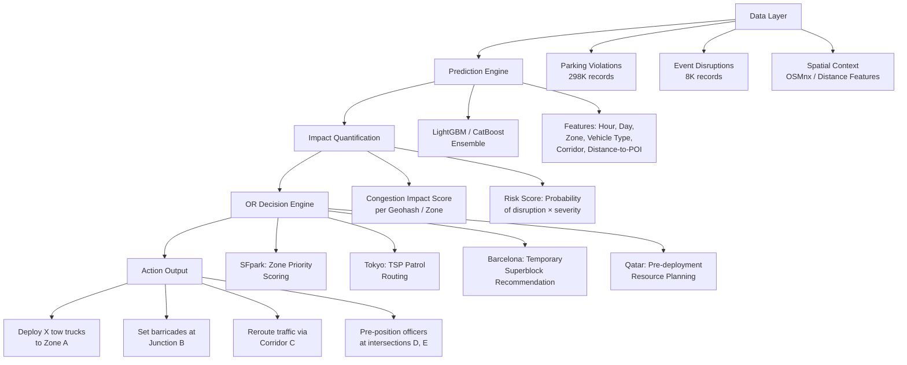

# Deep Research: Global Strategies & Dataset Analysis for Round 2

---

## Part 1: How Countries Solved Parking-Induced Congestion (Problem 1)

### 🇺🇸 San Francisco — SFpark (Demand-Responsive Pricing)

| Aspect | Detail |
|---|---|
| **Core Idea** | Dynamic parking pricing adjusted block-by-block based on real-time occupancy |
| **Technology** | Thousands of in-ground wireless magnetometer sensors tracking occupancy |
| **Algorithm** | Target 60–80% occupancy per block. If block is full → price increases. If empty → price decreases. Adjustments every 1–2 months |
| **Results** | Parking search time dropped **43–50%**, cruising distance reduced **56–70%**, traffic volume down **7.7%** in pilot areas |
| **OR Technique** | Occupancy forecasting → price optimization → demand redistribution |

> [!TIP]
> **What to steal for your prototype:** The concept of a "Congestion Impact Score" per geohash/zone. Your LightGBM model predicts the score, and your OR engine outputs optimal enforcement deployment (analogous to SFpark's pricing but for police resources).

---

### 🇯🇵 Tokyo — Zero-Tolerance + ALPR Patrol Routing

| Aspect | Detail |
|---|---|
| **Core Idea** | Near-zero on-street parking allowed. ALPR patrol cars drive optimized routes |
| **Technology** | ALPR cameras on patrol cars, fixed ALPR at intersections, AI-powered plate recognition |
| **Enforcement** | Hybrid model: police + private parking attendants. Privatization massively increased coverage |
| **Process** | Violation sticker → registered owner reports to police → fine. Severe consequences for non-compliance |
| **Route Optimization** | Patrol routes optimized to cover highest-probability violation zones |

> [!TIP]
> **What to steal:** The **Traveling Salesperson Problem (TSP)** for patrol routing. Your model predicts the top-N violation hotspots, and your OR engine calculates the shortest route through all of them for a limited number of patrol vehicles.

---

### 🇪🇸 Barcelona — Superblocks (Network Flow Optimization)

| Aspect | Detail |
|---|---|
| **Core Idea** | 3×3 block grids where interior traffic is restricted to residents only; through-traffic pushed to perimeter |
| **Algorithm** | Network flow algorithms to balance internal restriction vs. perimeter congestion |
| **Key Threshold** | A **13% reduction in overall vehicle traffic** allows full implementation without net congestion increase |
| **Results** | Traffic volume reduced, parking removed from interior, significant noise/air pollution reductions |
| **OR Technique** | Network connectivity analysis, traffic redistribution modeling |

> [!TIP]
> **What to steal:** The concept of "temporary superblocks" — your model identifies which intersections are choking due to spillover parking, and the OR engine recommends where to place digital barricades/diversions to create traffic-free zones around the worst hotspots.

---

### 🇸🇬 Singapore — Electronic Road Pricing (ERP) + Real-Time AI

| Aspect | Detail |
|---|---|
| **Core Idea** | Congestion pricing that dynamically adjusts tolls based on real-time traffic |
| **Technology** | GPS-enabled vehicles, traffic cameras, road sensors, centralized AI processing |
| **Mechanism** | Dynamic toll adjustment pushes vehicles to less congested routes automatically |
| **Scale** | City-wide integration, not just parking-specific |

> [!TIP]
> **What to steal:** The "zone-based dynamic enforcement priority" concept. Instead of pricing, your system dynamically assigns enforcement priority scores to zones based on predicted congestion impact.

---

### 🇨🇴 Bogotá / 🇮🇩 Jakarta — Developing Country Strategies

| Aspect | Detail |
|---|---|
| **Bogotá** | "Pico y Placa" license plate restrictions + AI traffic flow prediction |
| **Jakarta** | Intelligent Traffic Control System (ITCS) with AI-optimized signal timings across major intersections |
| **Common Pattern** | Camera-based AI detection preferred over ground sensors (lower maintenance, easier deployment) |
| **Key Lesson** | Technology must be paired with demand-management policies to change behavior |
| **Motorcycle Challenge** | High 2-wheeler density (like Bangalore!) requires models that handle mixed traffic |

> [!IMPORTANT]
> **Why this matters for Bangalore:** Bangalore has massive scooter/motorcycle traffic (94,856 violations from scooters alone — the #1 vehicle type!). Your model must account for 2-wheeler behavior, not just cars.

---

## Part 2: How Countries Solved Event-Driven Congestion (Problem 2)

### 🇬🇧 London — Wembley Stadium (Microsimulation + Multi-Agency Coordination)

| Aspect | Detail |
|---|---|
| **Core Idea** | Bespoke transport plan per event, validated through microsimulation |
| **Technology** | **PTV Vissim** (vehicle simulation) + **VisWALK** (pedestrian flow), thousands of hours of crowd footage |
| **Process** | Custom plan per event → simulation → real-time info on motorway signs → modular barrier deployment at junctions |
| **Key Innovation** | Connected vehicle data identifies "harsh braking hotspots" as a feedback loop for future events |
| **Stakeholders** | The FA + London Borough of Brent + Highways England = multi-agency command |

> [!TIP]
> **What to steal:** The "bespoke event plan" concept. Your prototype generates a unique diversion/barricade plan for each event type × location × time combination. The "What-If Simulator" slider in Streamlit maps directly to this.

---

### 🇶🇦 Qatar — FIFA World Cup 2022 (Digital Twin + AI Resource Deployment)

| Aspect | Detail |
|---|---|
| **Core Idea** | Digital twin of entire transport network; simulate millions of fans leaving simultaneously |
| **Platform** | TASMU Platform (Microsoft/Siemens/Ooredoo partnership) |
| **Simulation** | VISSIM for vehicles + LEGION for pedestrians; 29+ simulation tests before the event |
| **AI Layer** | ML models with spatial-temporal dependencies; multinomial logit models for travel mode prediction |
| **Resource Deployment** | AI optimized bus fleet deployment, dynamic signal control, preemptive incident response |
| **Data Sources** | IoT sensors, traffic queue detection, pedestrian cameras — all feeding control centers |

> [!TIP]
> **What to steal:** The "pre-deployment based on simulation" concept. Your model runs what-if scenarios for different event types/sizes, and pre-deploys resources hours before the event starts. This is your OR "kill shot."

---

### 🇰🇷 Seoul — TOPIS (Big Data + Edge AI)

| Aspect | Detail |
|---|---|
| **Core Idea** | City-wide real-time traffic insights using big data and AI |
| **Technology** | Imaging radar, edge AI computing at intersections, queue detection |
| **Capability** | Detect incidents, violations, queue lengths in real-time → adjust signals immediately |

### 🇮🇳 Mumbai — Hybrid AI Models (LSTM + XGBoost)

| Aspect | Detail |
|---|---|
| **Core Idea** | Hybrid models combining deep learning temporal patterns with gradient boosting |
| **Features** | Event-based features (road closures, concerts) + weather data |
| **Challenge** | Infrastructure constraints, multi-modal mixed traffic |
| **Key Insight** | LSTM captures temporal sequences, XGBoost handles tabular event features → ensemble |

> [!IMPORTANT]
> **This is directly applicable to your architecture.** Mumbai's approach of LSTM + XGBoost is conceptually identical to your CatBoost + LightGBM ensemble. You already know how to build this.

---

## Part 3: Dataset Analysis

### Dataset 1 — Parking Violations (Problem 1)

**File:** `jan to may police violation_anonymized791b166.csv`

| Metric | Value |
|---|---|
| **Rows** | 298,450 |
| **Columns** | 24 |
| **Date Range** | Nov 9, 2023 → Apr 8, 2024 (~5 months) |
| **Lat Range** | 12.80 → 13.29 (covers full Bangalore) |
| **Lon Range** | 77.44 → 77.77 |

#### Key Columns
| Column | Type | Usability |
|---|---|---|
| `latitude`, `longitude` | float64 | ⭐ Direct spatial features — geohash encoding |
| `vehicle_type` | string | ⭐ Categorical feature (Scooter dominates) |
| `violation_type` | string (JSON array) | ⭐ Multi-label classification target |
| `created_datetime` | datetime | ⭐ Time features (hour, day, month, cyclical) |
| `police_station` | string | ⭐ Zone/area grouping |
| `junction_name` | string | ⭐ Spatial anchor points |
| `center_code` | float | Zone identifier |
| `validation_status` | string | Data quality filter |
| `device_id` | string | Camera/sensor identifier |
| `offence_code` | string (JSON array) | Violation severity encoding |

#### Critical Findings

**Violation Types Distribution:**
```
WRONG PARKING:          138,764 (46.5%)
NO PARKING:             119,576 (40.1%)
PARKING IN MAIN ROAD:    ~18,000 (combined variants)
PARKING ON FOOTPATH:      ~2,700
DOUBLE PARKING:              367
```

**Vehicle Types — Scooters DOMINATE:**
```
SCOOTER:        94,856 (31.8%)  ← #1!
CAR:            88,870 (29.8%)
MOTOR CYCLE:    40,811 (13.7%)
PASSENGER AUTO: 37,813 (12.7%)
MAXI-CAB:       11,372 (3.8%)
```

> [!WARNING]
> **2-wheelers (Scooter + Motor Cycle) account for 45.5% of all parking violations.** This is a Bangalore-specific phenomenon that Western models don't handle. Your model MUST treat vehicle type as a first-class feature.

**Top Violation Hotspot Police Stations:**
```
Upparpet:         34,468 (11.5%)  ← CBD/City core
Shivajinagar:     28,044 (9.4%)   ← CBD
Malleshwaram:     22,200 (7.4%)   ← Residential/commercial mix
HAL Old Airport:  20,819 (7.0%)   ← IT corridor adjacent
City Market:      17,646 (5.9%)   ← Transit/logistics hub
```

**Top Named Junctions (excluding "No Junction"):**
```
Safina Plaza Junction:     15,449
KR Market Junction:        11,538
Elite Junction:            10,718
Sagar Theatre Junction:    10,549
Central Street Junction:    5,388
```

**Temporal Patterns (CRITICAL — timestamps are in UTC, Bangalore is UTC+5:30):**

Converted to IST (add 5.5 hours to UTC hour):
```
Peak IST hours:   ~8:30-13:30 (UTC 3-8)   → MORNING ENFORCEMENT WINDOW
                  ~1:30-4:30 AM (UTC 20-23) → LATE NIGHT (commercial areas closing)
Off-peak IST:     ~18:30-22:30 (UTC 13-17) → EVENING DIP
```

> [!IMPORTANT]
> The timestamps are in UTC! When you display on the Streamlit map, convert to IST (UTC+5:30). The peak violation hours are **morning to early afternoon** IST, which aligns perfectly with commercial/shopping activity in the CBD.

**Day-of-Week Pattern:**
```
Sunday:    46,865 (highest!)   ← Shopping/leisure activity
Saturday:  43,427
Wednesday: 43,067
Monday:    38,931 (lowest)
Weekend/Weekday ratio: 0.43
```

**Weekend Hotspot Shift:**
- Weekends: Upparpet, Shivajinagar, Malleshwaram surge (shopping districts)
- This validates the "Pub & Cafe Hub" theory — commercial areas peak on weekends

---

### Dataset 2 — Astram Event Data (Problem 2)

**File:** `Astram event data_anonymized - Astram event data_anonymizedb40ac87.csv`

| Metric | Value |
|---|---|
| **Rows** | 8,173 |
| **Columns** | 46 |
| **Date Range** | Nov 9, 2023 → Apr 8, 2024 |
| **Lat Range** | 12.80 → 13.27 |
| **Lon Range** | 77.31 → 77.77 |

#### Event Types
```
Unplanned: 7,706 (94.3%)  ← Overwhelmingly unplanned events
Planned:     467 (5.7%)
```

#### Event Causes (The Reality of Bangalore)
```
vehicle_breakdown:    4,896 (59.9%)  ← DOMINANT cause
others:                 638 (7.8%)
pot_holes:              537 (6.6%)   ← Road infrastructure
construction:           480 (5.9%)
water_logging:          458 (5.6%)   ← Monsoon effect
accident:               365 (4.5%)
tree_fall:              284 (3.5%)
road_conditions:        170 (2.1%)
congestion:             136 (1.7%)
public_event:            84 (1.0%)   ← Actual "events"
procession:              72 (0.9%)
vip_movement:            20 (0.2%)
protest:                 15 (0.2%)
```

> [!WARNING]
> **Surprise finding: This is NOT a "events like cricket matches" dataset.** 94% is unplanned disruptions, with **vehicle breakdowns alone being 60% of all events.** The "public_event" category is only 84 records (1%). This fundamentally changes the Problem 2 strategy.

#### Planned Event Breakdown
```
construction:    311 (66.6%)
public_event:     84 (18.0%)
procession:       38 (8.1%)
vip_movement:     20 (4.3%)
protest:           8 (1.7%)
```

#### Priority Distribution
```
High: 5,030 (61.5%)
Low:  3,141 (38.5%)
```

#### Road Closures
```
No closure:  7,497 (91.7%)
Closure:       676 (8.3%)
```
Top causes requiring road closure: vehicle_breakdown (210), construction (127), tree_fall (112)

#### Top Corridors (HIGH priority events)
```
Mysore Road:      741  ← #1 most disrupted corridor
Bellary Road 1:   610
Tumkur Road:      454
Bellary Road 2:   379
Hosur Road:       298
ORR North 1:      275
Old Madras Road:  263
```

#### Event Duration Statistics
```
Median:  10.8 hours
Mean:    43.7 hours (skewed by long-running events)
75th %:  21.3 hours
```
Accidents average 201 hours(!), vehicle breakdowns average 179 hours — these are likely resolution/closure time, not actual blockage duration.

#### Zones
```
Central Zone 2:  623 (highest event density)
West Zone 1:     433
North Zone 2:    413
West Zone 2:     358
South Zone 2:    354
```

#### Top Junctions
```
Mekhri Circle:             64 events
Ayyappa Temple Junction:   49
Satellite Bus Stand Junc:  43
Yeshwanthpura Circle:      38
Yelahanka Circle:          34
Silk Board Junction:       33
```

---

## Part 4: The Hybrid Strategy — Combining Global Approaches for Bangalore

> [!IMPORTANT]
> Based on the dataset analysis, here is the critical pivot: **Problem 2's dataset is NOT about stadiums and festivals — it's about infrastructure failures (breakdowns, potholes, water logging).** This actually makes a hybrid approach even MORE powerful, because both datasets describe the same phenomenon: **localized disruptions that choke traffic flow.**

### The Unified "Traffic Disruption Intelligence Engine"

Instead of treating Problems 1 and 2 as separate challenges, combine them into a **single unified system** that handles ANY type of traffic disruption:



### Strategy Components (Mapping Global → Bangalore)

| Global Strategy | Bangalore Adaptation | Data Source | OR Technique |
|---|---|---|---|
| **SFpark** (Zone Scoring) | Dynamic enforcement priority per police station zone | Parking violations by zone × hour | Weighted scoring function |
| **Tokyo TSP** (Patrol Routing) | Optimal route for patrol vehicles through top-N hotspot junctions | Top junctions ranked by violation density | TSP / Linear Programming (PuLP/SciPy) |
| **Barcelona Superblocks** (Flow Diversion) | Temporary "no-parking enforcement zones" around choking intersections | Spatial clustering of violations near junctions | Network flow analysis |
| **Qatar Digital Twin** (Pre-deployment) | Predict disruption risk by time slot and pre-deploy | Event data temporal patterns + parking temporal patterns | Scenario simulation |
| **Singapore ERP** (Zone Priority) | Dynamic reallocation of limited police resources between zones | Combined violation + event density scoring | Integer Linear Programming |
| **Mumbai Hybrid** (LSTM+XGBoost) | Your existing CatBoost+LightGBM ensemble with Nelder-Mead | Proven Round 1 architecture | Ensemble optimization |

### The Three-Layer Architecture

```
┌─────────────────────────────────────────────────────────┐
│  LAYER 3: STREAMLIT DASHBOARD (The Presentation)        │
│  ┌──────────┐  ┌──────────────┐  ┌───────────────────┐  │
│  │ What-If  │  │ Folium Map   │  │ Resource Deploy   │  │
│  │ Simulator│  │ (Heatmap)    │  │ Directive         │  │
│  │          │  │              │  │                   │  │
│  │ Hour: 10 │  │ 🔴🔴🟡      │  │ Deploy 4 trucks   │  │
│  │ Day: Sun │  │  🔴🟡       │  │ to Upparpet Zone  │  │
│  │ VehType: │  │   🟡🟢      │  │ Barricade KR Mkt  │  │
│  │ Scooter  │  │              │  │ Reroute via ORR   │  │
│  └──────────┘  └──────────────┘  └───────────────────┘  │
├─────────────────────────────────────────────────────────┤
│  LAYER 2: OR DECISION ENGINE (The Kill Shot)            │
│  • SciPy/PuLP Linear Programming                        │
│  • Constraint: Limited police units (e.g., 20 officers) │
│  • Objective: Maximize total "Congestion Relief Score"   │
│  • TSP for patrol routing between assigned zones         │
├─────────────────────────────────────────────────────────┤
│  LAYER 1: ML PREDICTION ENGINE (Your Proven Core)       │
│  • CatBoost + LightGBM + Nelder-Mead ensemble           │
│  • Pre-computed predictions for all scenario combos      │
│  • Stored in SQLite / CSV for instant dashboard fetch    │
└─────────────────────────────────────────────────────────┘
```

---

## Part 5: How to Analyze Bangalore Traffic Remotely

### Method 1: Google Maps "Typical Traffic" (FREE, Visual)

**What it gives you:** Historical average congestion for any day × hour combination.

**How to use it:**
1. Go to [Google Maps](https://maps.google.com) → search "Bengaluru"
2. Click the **Layers** icon (bottom-left) → enable **Traffic**
3. At the bottom, switch from "Live traffic" to **"Typical traffic"**
4. Use the **day** and **time slider** to see patterns:
   - Friday 6:00 PM → Observe Indiranagar/Koramangala turning red
   - Monday 9:00 AM → Observe Silk Board / ORR turning dark red
   - Sunday 11:00 AM → Observe MG Road / Commercial Street area

**For your prototype:** Take screenshots at key time slots and embed them in your presentation slides to visually validate your model's predictions.

### Method 2: OpenStreetMap + OSMnx (FREE, Programmable)

```python
import osmnx as ox

# Download Bangalore's drivable road network
G = ox.graph_from_place("Bengaluru, India", network_type="drive")

# Get Points of Interest (POIs)
tags = {"amenity": ["bus_station", "parking"], "railway": "station"}
pois = ox.features_from_place("Bengaluru, India", tags)

# Calculate distance from any point to nearest metro station
# Use ox.distance.nearest_nodes() to find closest node
```

**Feature Engineering with OSMnx:**
- `distance_to_nearest_metro` — proximity to metro stations (high foot traffic, cab idling)
- `distance_to_ORR` — proximity to Outer Ring Road (IT corridor)
- `distance_to_CBD` — proximity to MG Road/Majestic (12.9716, 77.5946)
- `road_type` — extract from OSM whether it's a highway, residential, or primary road
- `num_lanes` — lane count affects how much parking impacts flow

### Method 3: TomTom Traffic Index (FREE, Statistical Baseline)

Bangalore is ranked as one of the world's most congested cities. TomTom provides:
- Average congestion level by hour
- Expected travel time increase during rush hour
- Historical year-over-year trends

**Use for:** Baseline statistics to calibrate your model's output. If TomTom says Bangalore sees 60% travel time increase at 6 PM, your model's predictions for that time slot should align.

### Method 4: Bangalore Traffic Police (BTP) Social Media (FREE, Ground Truth)

**X/Twitter handle:** [@blaborcommr](https://twitter.com/blaborcommr) and BTP Traffic handles

**What to look for:**
- Past diversion plans during IPL matches at Chinnaswamy Stadium
- No-parking zones during political rallies
- Waterlogging alerts during monsoon season
- Construction-related road closures

**For your prototype:** Hardcode real BTP diversion rules as "expert rules" in your OR engine. E.g., "When event_cause = public_event AND zone = Central Zone 2, deploy barricades at KR Circle, Townhall Junction."

### Method 5: Your Own Datasets (Already in hand!)

Your two datasets ARE the Bangalore traffic analysis. Here's what they already tell you:

**Peak Violation Hours (IST, converted from UTC):**
```
PARKING VIOLATIONS PEAK: 8:30 AM - 2:00 PM IST
                         (matches commercial/shopping hours)
EVENT DISRUPTIONS PEAK:  3:00 AM - 12:00 PM IST
                         (vehicle breakdowns peak in early morning
                          when heavy vehicles operate)
```

**Spatial Hotspots Already Identified:**

| Rank | Parking Hotspot (Police Station) | Event Hotspot (Corridor) |
|---|---|---|
| 1 | Upparpet (34,468 violations) | Mysore Road (741 events) |
| 2 | Shivajinagar (28,044) | Bellary Road 1 (610) |
| 3 | Malleshwaram (22,200) | Tumkur Road (454) |
| 4 | HAL Old Airport (20,819) | Bellary Road 2 (379) |
| 5 | City Market (17,646) | Hosur Road (298) |

**Cross-Analysis Insights:**
- Upparpet + City Market = CBD core. These are **pure parking problems** (narrow roads, retail density)
- Mysore Road + Tumkur Road + Bellary Road = **major arterial corridors** where vehicle breakdowns cripple flow
- ORR/HSR Layout/Bellandur = **IT corridor** with cab/auto idling problems
- The overlap between parking hotspots and event hotspots is LOW → they represent different problem types in different geographic zones → **perfect for a hybrid dashboard**

---

## Part 6: Recommended Feature Engineering

### For the Parking Model (Dataset 1)

| Feature | Source | Rationale |
|---|---|---|
| `hour_sin`, `hour_cos` | `created_datetime` | Cyclical encoding (your Round 1 technique) |
| `day_of_week` | `created_datetime` | Categorical (Sunday is peak) |
| `is_weekend` | `created_datetime` | Binary flag |
| `month` | `created_datetime` | Seasonal patterns |
| `vehicle_type_encoded` | `vehicle_type` | Target encoding or one-hot |
| `violation_severity` | `offence_code` | Count of violation codes = severity proxy |
| `geohash_6` | `lat/lon` | Spatial grouping at ~1.2km resolution |
| `distance_to_CBD` | `lat/lon` vs (12.9716, 77.5946) | Haversine distance |
| `distance_to_ORR` | `lat/lon` vs ORR polyline | Min distance to nearest ORR point |
| `is_junction` | `junction_name` | Boolean: named junction vs "No Junction" |
| `junction_violation_density` | `junction_name` | Historical count per junction |
| `zone_violation_density` | `police_station` | Historical count per zone |

### For the Event Model (Dataset 2)

| Feature | Source | Rationale |
|---|---|---|
| `event_type` | `event_type` | Binary: planned/unplanned |
| `event_cause` | `event_cause` | Categorical (vehicle_breakdown dominant) |
| `is_road_closure` | `requires_road_closure` | Binary severity indicator |
| `priority` | `priority` | Binary: High/Low |
| `corridor_type` | `corridor` | Major arterial vs non-corridor |
| `hour_sin`, `hour_cos` | `start_datetime` | Temporal pattern |
| `day_of_week` | `start_datetime` | Day-specific patterns |
| `vehicle_type` | `veh_type` | BMTC bus, heavy vehicle, etc. |
| `zone` | `zone` | Geographic zone (10 zones) |
| `junction_risk_score` | `junction` | Historical event frequency per junction |
| `corridor_risk_score` | `corridor` | Historical event frequency per corridor |

---

## Part 7: Next Steps (Recommended Priority Order)

1. **Decide your theme** — Based on dataset analysis:
   - **Problem 1 (Parking)** has **298K rows** = much richer dataset for ML
   - **Problem 2 (Events)** has **8K rows** = smaller but has richer metadata (corridors, zones, junctions)
   - **Hybrid approach** = Use both datasets to build a unified "Traffic Disruption Intelligence Engine"

2. **Feature engineer** both datasets using the tables above

3. **Train prediction models** — Your existing CatBoost + LightGBM pipeline

4. **Build the OR Decision Engine** — SciPy/PuLP for patrol optimization

5. **Pre-compute scenarios** — Generate predictions for all hour × day × zone combos → store in SQLite

6. **Build Streamlit dashboard** — 3-panel layout (Simulator → Map → Directive)

7. **Validate against Google Maps** — Screenshot "Typical Traffic" at predicted peak hours to prove alignment
